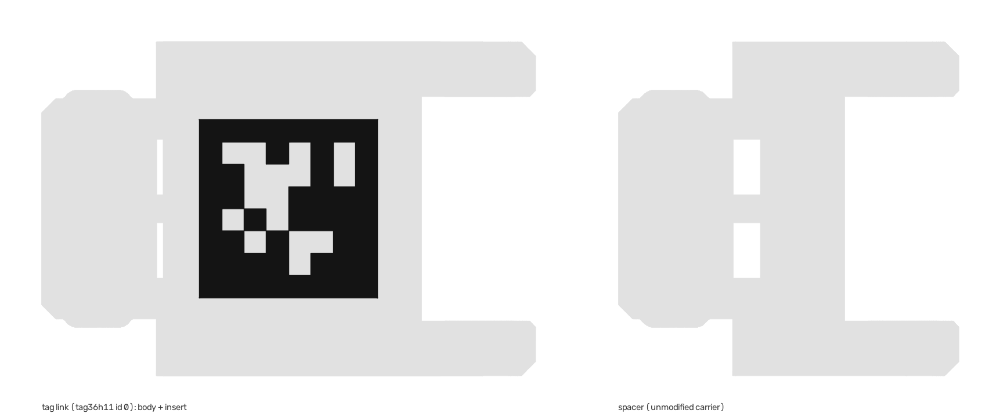

# apriltag-bracelet-gen

Generates multicolor-printable AprilTag "links" for a modular snap-together
bracelet: takes a carrier link (any bracelet/chain design, as a STEP file),
stretches its flat spine to fit a real AprilTag, and outputs two STLs per
link -- a body (print in a light filament) and an insert (print in black) --
that snap into place next to that carrier's unmodified links.

Built for wrist-worn fiducial tracking (e.g. anchoring egocentric-video hand
pose to a known reference frame for imitation-learning data collection), but
nothing here is specific to that use case.



*Left: generated tag link (tag36h11 id 0) -- light body with the black insert
sitting flush in its pockets. Right: the unmodified carrier, exported as the
spacer. Both joint ends are identical, so they snap together.*

`examples/` has this link's `_body.stl` + `_insert.stl` and its
`metadata.json` if you want to try the print workflow before installing
anything.

## How it works

1. You give it a carrier STEP file and a `CarrierProfile` (a small JSON
   describing where that link's flat, constant-cross-section "spine" is,
   between its two joint ends).
2. It cuts the carrier at those two points, keeps both joint ends completely
   unmodified (so the result stays snap-compatible with your other,
   unmodified links), and replaces the spine with a longer flat box.
3. It fetches the real bitmap for whichever AprilTag family/id you ask for
   from the official [AprilRobotics/apriltag-imgs](https://github.com/AprilRobotics/apriltag-imgs)
   repo (not a hand-approximated pattern), and cuts pockets into the new
   spine's top face for every black module, plus a matching insert solid
   that plugs those pockets flush.

## Install

```
pip install -r requirements.txt
```

`cadquery` pulls in an OCCT-based geometry kernel and can take a few
minutes to install the first time.

## Get a carrier file + build its profile

This repo does **not** bundle a carrier STEP file -- bracelet/chain-link
models are usually someone else's design (e.g. from Printables or
Thingiverse) with their own license, so bring your own. Put it somewhere
under `carriers/` (that path is gitignored so you won't accidentally commit
someone else's model).

To calibrate a `CarrierProfile` for a new carrier you haven't used before:

```
python3 -m link_gen.profile_finder path/to/your_link.step
```

This scans the solid along X and prints its Y/Z cross-section at each slice.
Look for a contiguous run where the cross-section stops changing -- that's
your flat spine. Pick `x_cut_left` / `x_cut_right` safely inside that run
(not right on the boundary row) and read `spine_y_min/max` /
`spine_z_min/max` straight off that row. Save it as JSON, e.g.
`carriers/your_link.profile.json`:

```json
{
  "x_cut_left": 0.5,
  "x_cut_right": 7.5,
  "spine_y_min": -12.0,
  "spine_y_max": 12.0,
  "spine_z_min": -6.0,
  "spine_z_max": 0.0,
  "solid_index": 0,
  "tag_face": "z_min"
}
```

`tag_face` (`z_max` or `z_min`) says which spine face ends up facing outward
once links are snapped into a curved loop. That isn't derivable from the
STEP file alone -- print one link, and if the tag ends up on the inside,
flip it. (For `chainlink_v10` it's `z_min`.) `--tag-face` on the CLI
overrides it for a single run.

`carriers/chainlink_v10.profile.json` in this repo is a working example --
it's calibrated for the free "Chain Link Bracelet" snap-link design (a
single-roller-boss + forked-double-roller hinge, flat spine between them).
Grab that model yourself and point `--carrier` at your own copy to use it.

**Assumptions this tool makes about a carrier** (the scan above helps verify
these hold for your file): both joint ends sit on either side of the spine
along the carrier's local **X axis**, and the spine's cross-section is a
plain constant-section prism (not tapered/filleted) across
`[x_cut_left, x_cut_right]`.

## Generate links

```
python3 -m link_gen.cli generate \
  --carrier carriers/your_link.step \
  --profile carriers/your_link.profile.json \
  --family tag36h11 \
  --wrist both
```

That writes `outputs/left_wrist/` (ids 0-7), `outputs/right_wrist/`
(ids 20-27), and `outputs/spacer_<carrier>.stl` -- the unmodified carrier
link, exported once per run, so you can print the plain links that go
between tag links from the same folder. All options:

- `--wrist left|right|both` (default `both`). Each wrist gets its own
  folder under `--out-dir` with its own `manifest.csv` + `metadata.json`.
- `--ids` overrides the left wrist's ids (or the single wrist's), and
  `--right-ids` the right wrist's. Both accept a range (`0-7`), a comma
  list (`0,2,5`), or a single id.
- `--tag-size 16`, `--extra-length 11`, `--pocket-depth 0.4`,
  `--tag-face z_max|z_min`, `--out-dir outputs` -- see below.
- `--tag-size` is the full tag footprint in mm, quiet zone included --
  must fit within `spine_len + extra_length` and within `spine_width`.
- `--extra-length` is how much longer the spine gets vs. the carrier's
  original (so the finished link is longer than your plain links --
  that's expected; alternate tag-links with plain carrier links to fit
  your wrist, the same way you'd size-adjust the original chain).
- `--pocket-depth` controls how deep the tag geometry is recessed/raised;
  0.3-0.5mm is a reasonable range for a 0.4mm nozzle.

Verify the outputs decode (optional, but worth doing once per new
carrier/profile -- it catches mirroring or module-size mistakes before you
print). Rasterizes each insert as seen from the printed face and runs a real
AprilTag detector on it:

```
pip install pupil-apriltags opencv-python-headless trimesh
python3 -m link_gen.verify outputs/left_wrist
```

List supported families:

```
python3 -m link_gen.cli families
```

Output per id: `link_<family>_<id>_body.stl`, `link_<family>_<id>_insert.stl`,
plus `manifest.csv` and `metadata.json` in each wrist folder.

### metadata.json

Everything another machine needs to reproduce or detect the set:

- `generator`: git commit and the exact command line.
- `carrier` / `link_geometry_mm`: the profile and sizes that were used,
  plus `spacer_file` pointing at the plain-link STL.
- `detection`: family, ids, and **`pose_tag_size_mm`** -- the black border
  square's side length (12.8mm for a 16mm tag36h11), which is what a pose
  estimator wants, not the 16mm footprint. Includes ready-to-paste config
  for `pupil-apriltags`, `apriltag_ros` and OpenCV ArUco.
- `tags[].bitmap`: the exact 10x10 pattern cut for each id, row 0 = top as
  a camera sees it.
- `verification`: added by `link_gen.verify` -- per-id decode result.

## Printing (Bambu Studio / any AMS-capable slicer)

For each link: import both its `_body.stl` and `_insert.stl` into the same
project -- they share the carrier's original coordinate origin, so they'll
already be aligned, no repositioning needed. Right-click the body object ->
**Add part -> Load** -> select the matching `_insert.stl`. Assign the body
a light filament and the insert part black (or whatever contrast pair you're
printing in). Repeat per link, arrange on one plate, print.

Matte filament (PETG or matte PLA) is worth using over glossy -- glare at
oblique viewing angles is a common real-world AprilTag detection failure
mode, more so than raw resolution.

## Choosing a family and tag size

- `tag36h11` is the safest default: best false-positive rejection, which
  matters if you're auto-processing a lot of footage unsupervised.
- `tag25h9` trades some of that robustness for a slightly simpler pattern --
  worth trying if you're motion-blur-limited (fast wrist movement, camera
  close and moving).
- Keep each grid module >=~1.2mm on a 0.4mm nozzle. A 10x10-module family
  (tag36h11, tag25h9) at 16mm total gives 1.6mm modules; smaller than
  ~12mm total starts pushing print resolution.
- Give every link on a given wristband a unique id, and reserve separate id
  blocks per wrist (e.g. left = 0-7, right = 20-27) so a single visible tag
  tells you both which wrist and roughly what orientation you're looking
  at, even with the other wrist's band out of frame.

## Repo layout

```
link_gen/
  tag_source.py      # fetches + caches official AprilTag bitmaps
  geometry.py         # CarrierProfile + the actual cut/stretch/pocket CAD logic
  profile_finder.py   # scans a new carrier STEP to help calibrate a profile
  cli.py              # `generate` / `families` commands
  verify.py           # decodes generated inserts with a real detector
carriers/
  *.profile.json       # calibration data (safe to commit)
  *.step                # your own carrier files (gitignored)
examples/              # one generated link (id 0) + its metadata + the preview above
outputs/               # generated sets (gitignored)
```
